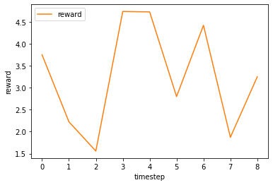

# BasicGym: A basic, configurative reinforcement learning environment
<details>
<summary><strong>Table of Contents </strong>(click to expand)</summary>

- [BasicGym: A basic reinforcement learning environment](#BasicGym-a-reinforcement-learning-environment-for-synthetic-simulation)
- [Overview](#overview)
- [Installation](#installation)
- [Usage](#usage)
- [Citation](#citation)
- [Contribution](#contribution)
- [License](#license)
- [Project Team](#project-team)
- [Contact](#contact)
- [Reference](#reference)

</details>

## Overview

*BasicGym* is an open-source simulation platform for synthetic simulation, which is written in Python. The simulator is particularly intended for reinforcement learning algorithms and follows [OpenAI Gym](https://gym.openai.com) and [Gymnasium](https://gymnasium.farama.org/)-like interface. We design SyntheticGym as a configurative environment so that researchers and practitioner can customize the environmental modules including `StateTransitionFunction` and `RewardFunction`

Note that, SyntheticGym is publicized under [scope-rl](../) repository, which facilitates the implementation of offline reinforcement learning procedure.

### Basic Setting

We formulate the following (Partially Observable) Markov Decision Process ((PO)MDP):
- `state`: 
   - State observation, which may be noisy in POMDPs.
- `action`:  
   - Indicating the action to presented by the RL agent.
- `reward`:
   - Reward observation.

### Implementation

SyntheticGym provides a standardize environment in both discrete and continuous action settings.
- `"BasicEnv-continuous-v0"`: Standard continuous environment.
- `"BasicEnv-discrete-v0"`: Standard discrete environment.

SyntheticGym consists of the following a environments.
- [BasicEnv](./envs/basic.py#L18): The basic configurative environment.

SyntheticGym is configurative about the following a module.
- [StateTransitionFunction](./envs/simulator/function.py#L14): Class to define the state transition function.
- [RewardFunction](./envs/simulator/function.py#L101): Class to define the reward function.

Note that, users can customize the above modules by following the [abstract class](./envs/simulator/base.py).

## Installation
SyntheticGym can be installed as a part of [scope-rl](../) using Python's package manager `pip`.
```
pip install scope-rl
```

You can also install from source.
```bash
git clone https://github.com/negocia-inc/scope-rl
cd scope-rl
python setup.py install
```

## Usage

We provide an example usage of the standard and customized environment. \
The online/offlline RL and Off-Policy Evaluation examples are provides in [SCOPE-RL's README](../README.md).

### Standard SyntheticEnv

Our standard SyntheticEnv is available from `gym.make()`, following the [OpenAI Gym](https://gym.openai.com) and [Gymnasium](https://gymnasium.farama.org/)-like interface.

```Python
# import SyntheticGym and gym
import basicgym
import gym

# (1) standard environment 
env = gym.make('BasicEnv-continuous-v0')
```

The basic interaction is performed using only four lines of code as follows.

```Python
obs, info = env.reset()
while not done:
    action = agent.sample_action_online(obs)
    obs, reward, done, truncated, info = env.step(action)
```

Let's visualize the case with uniform random policy .

```Python
# import from other libraries
from scope_rl.policy import OnlineHead
from d3rlpy.algos import RandomPolicy as ContinuousRandomPolicy

# define a random agent
agent = OnlineHead(
    ContinuousRandomPolicy(
        action_scaler=MinMaxActionScaler(
            minimum=0.1,  # minimum value that policy can take
            maximum=10,  # maximum value that policy can take
        )
    ),
    name="random",
)
agent.build_with_env(env)

# (2) basic interaction 
obs, info = env.reset()
done = False
# logs
reward_list = []

while not done:
    action = agent.sample_action_online(obs)
    obs, reward, done, truncated, info = env.step(action)
    # logs
    reward_list.append(reward)


# visualize the result
fig = plt.figure()
ax1 = fig.add_subplot(111)
ax1.plot(reward_list[:-1], label='reward', color='tab:orange')
ax1.set_xlabel('timestep')
ax1.set_ylabel('reward')
ax1.legend(loc='upper left')
plt.show()
```
<div align="center"></div>
<figcaption>
<p align="center">
  Reward Observed during a Single Episode
</p>
</figcaption>

Note that, while we use [SCOPE-RL](../README.md) and [d3rlpy](https://github.com/takuseno/d3rlpy) here, SyntheticGym is compatible with any other libraries working on the [OpenAI Gym](https://gym.openai.com) and [Gymnasium](https://gymnasium.farama.org/)-like interface.

### Customized SyntheticEnv

Next, we describe how to customize the environment by instantiating the environment.

<details>
<summary>List of environmental configurations: (click to expand)</summary>

- `step_per_episode`: Number of timesteps in an episode.
- `state_dim`: Dimension of the state.
- `action_type`: Action type of the RL agent.
- `n_actions`: Number of actions in the discrete action case.
- `action_dim`: Dimension of the action (context).
- `action_context`: Feature vectors that characterizes each action. Applicable only when action_type is "discrete".
- `reward_type`: Reward type.
- `reward_std`: Noise level of the reward. Applicable only when reward_type is "continuous".
- `obs_std`: Noise level of the state observation.
- `StateTransitionFunction`: State transition function.
- `RewardFunction`: Mean reward function.
- `random_state` : Random state.

</details>

```Python
from basicgym import BasicEnv
env = BasicEnv(
    state_dim=10,
    action_type="continuous",  # "discrete"
    action_dim=5,
    reward_type="continuous",  # "ninary"
    reward_std=0.3,
    obs_std=0.3,
    step_per_episode=10,
    random_state=12345,
)
```

Specifically, users can define their own `StateTransitionFunction` and `RewardFunction` as follows.

#### Example of Custom State Transition Function
```Python
# import basicgym modules
from basicgym import BaseStateTransitionFunction
# import other necessary stuffs
from dataclasses import dataclass
from typing import Optional
import numpy as np

@dataclass
class CustomizedStateTransitionFunction(BaseStateTransitionFunction):
    state_dim: int
    action_dim: int
    random_state: Optional[int] = None

    def __post_init__(self):
        self.random_ = check_random_state(self.random_state)
        self.state_coef = self.random_.normal(loc=0.0, scale=1.0, size=(self.state_dim, self.state_dim))
        self.action_coef = self.random_.normal(loc=0.0, scale=1.0, size=(self.state_dim, self.action_dim))

    def step(
        self,
        state: np.ndarray,
        action: np.ndarray,
    ) -> np.ndarray:
        state = self.state_coef @ state / self.state_dim +  self.action_coef @ action / self.action_dim
        state = state / np.linalg.norm(state, ord=2)
        return state
```

#### Example of RewardFunction
```Python
# import basicgym modules
from basicgym import BaseRewardFunction
# import other necessary stuffs
from dataclasses import dataclass
from typing import Optional
import numpy as np

@dataclass
class CustomizedRewardFunction(BaseRewardFunction):
    state_dim: int
    action_dim: int
    reward_type: str = "continuous"  # "binary"
    reward_std: float = 0.0
    random_state: Optional[int] = None

    def __post_init__(self):
        self.random_ = check_random_state(self.random_state)
        self.state_coef = self.random_.normal(loc=0.0, scale=1.0, size=(self.state_dim, ))
        self.action_coef = self.random_.normal(loc=0.0, scale=1.0, size=(self.action_dim, ))

    def mean_reward_function(
        self,
        state: np.ndarray,
        action: np.ndarray,
    ) -> float:
        reward = self.state_coef.T @ state / self.state_dim + self.action_coef.T @ action / self.action_dim
        return reward
```

More examples are available at [quickstart/basic_synthetic_customize_env.ipynb](./examples/quickstart/basic_synthetic_customize_env.ipynb). 

## Citation

If you use our software in your work, please cite our paper:

Haruka Kiyohara, Ren Kishimoto, Kosuke Kawakami, Ken Kobayashi, Kazuhide Nakata, Yuta Saito.<br>
**Title**<br>
[link]()

Bibtex:
```
```

## Contribution

Any contributions to SyntheticGym are more than welcome!
Please refer to [CONTRIBUTING.md](../CONTRIBUTING.md) for general guidelines how to contribute the project.

## License

This project is licensed under Apache 2.0 license - see [LICENSE](../LICENSE) file for details.

## Project Team

- [Haruka Kiyohara](https://sites.google.com/view/harukakiyohara) (**Main Contributor**; Tokyo Institute of Technology)
- Ren Kishimoto (Tokyo Institute of Technology)
- Kosuke Kawakami (negocia Inc.)
- Ken Kobayashi (Tokyo Institute of Technology)
- Kazuhide Nakata (Tokyo Institute of Technology)
- [Yuta Saito](https://usait0.com/en/) (Cornell University)

## Contact

For any question about the paper and software, feel free to contact: kiyohara.h.aa@m.titech.ac.jp

## References

<details>
<summary><strong>Papers </strong>(click to expand)</summary>

1. Greg Brockman, Vicki Cheung, Ludwig Pettersson, Jonas Schneider, John Schulman, Jie Tang, and Wojciech Zaremba. [OpenAI Gym](https://arxiv.org/abs/1606.01540). *arXiv preprint arXiv:1606.01540*, 2016.

2. Takuma Seno and Michita Imai. [d3rlpy: An Offline Deep Reinforcement Library](https://arxiv.org/abs/2111.03788), *arXiv preprint arXiv:2111.03788*, 2021.


</details>

<details>
<summary><strong>Projects </strong>(click to expand)</summary>

This project is inspired by the following package.
- **Open Bandit Pipeline**  -- a pipeline implementation of OPE in contextual bandits: [[github](https://github.com/st-tech/zr-obp)] [[documentation](https://zr-obp.readthedocs.io/en/latest/)] [[paper](https://arxiv.org/abs/2008.07146)]

</details>

