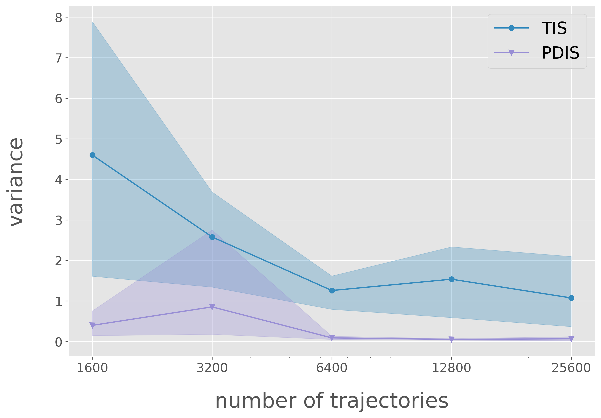
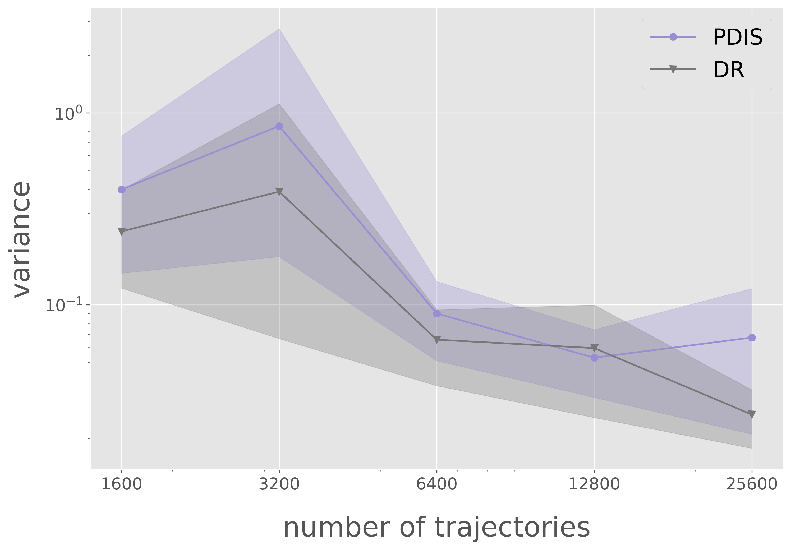

Tutorial
==========

.. _overview_ope:

Off-Policy Evaluation
~~~~~~~~~~
We consider a general reinforcement learning setup, which is formalized by Markov Decision Process (MDP) as :math:`\langle \mathcal{S}, \mathcal{A}, \mathcal{T}, P_r, \gamma \rangle`.
:math:`\mathcal{S}` is the state space and :math:`\mathcal{A}` is the action space, which is either discrete or continuous.
Let :math:`\mathcal{T}: \mathcal{S} \times \mathcal{A} \rightarrow \mathcal{P}(\mathcal{S})` is the state transition probability where :math:`\mathcal{T}(s' | s,a)` is the probability of observing state :math:`s'` after taking action :math:`a` given state :math:`s`.
:math:`P_r: \mathcal{S} \times \mathcal{A} \times \mathbb{R} \rightarrow [0,1]` is the probability distribution of the immediate reward.
Given :math:`P_r`, :math:`R: \mathcal{S} \times \mathcal{A} \rightarrow \mathbb{R}` is the expected reward function where :math:`R(s,a) := \mathbb{E}_{r \sim P_r (r | s, a)}[r]` is the expected reward when taking action :math:`a` for state :math:`s`.
We also let :math:`\gamma \in (0,1]` be a discount factor. Finally, :math:`\pi: \mathcal{S} \rightarrow \mathcal{P}(\mathcal{A})` denotes a *policy* where :math:`\pi(a| s)` is the probability of taking action :math:`a` at a given state :math:`s`.
Note that we also denote :math:`d_0` as the initial state distribution.

.. card:: Problem Formulation
    :img-top: ../_static/images/ope_formulation.png
    :text-align: center

In OPE/OPS, we are given a logged dataset :math:`\mathcal{D}` consisting of :math:`n` trajectories, each of which is generated by a behavior policy :math:`\pi_0` as follows.

.. math::

    \tau := \{ (s_t, a_t, s_{t+1}, r_t) \}_{t=0}^{T} \sim p(s_0) \prod_{t=0}^{T} \pi_0(a_t | s_t) \mathcal{T}(s_{t+1} | s_t, a_t) P_r (r_t | s_t, a_t)

Our goal is to leverage this the logged dataset to accurately evaluate the performance of evaluation policies (OPE) and to select the best candidate policies based on OPE result (OPS).

.. _overview_basic_ope:

Policy Value Estimation
----------

In the basic OPE, we aim at evaluating the *policy value* or the expected trajectory-wise reward of the given evaluation policy :math:`\pi`:

.. math::

    J(\pi) := \mathbb{E}_{\tau} \left [ \sum_{t=0}^{T-1} \gamma^t r_{t} \mid \pi \right ],

Estimating the policy value before deploying policy in online environment is beneficial, as we can reduce the deployment cost and risks in online evaluation.
However, the challenge is that we need to answer a counterfactual question, *''What if a new policy chooses a different action from that of behavior policy?''*
by dealing with the distribution shift between :math:`\pi_0` and :math:`\pi`.

.. seealso::

    * :doc:`Supported OPE estimators <evaluation_implementation>` and :doc:`their API reference <_autosummary/ofrl.ope.basic_estimators_discrete>` 
    * (advanced) :doc:`Marginal OPE estimators <evaluation_implementation>`, and their :doc:`API reference <_autosummary/ofrl.ope.marginal_ope_discrete>`
    * :doc:`Quickstart <quickstart>` and :doc:`related tutorials <_autogallery/basic_ope/index>`

Standard OPE estimators
----------

.. _implementation_dm:

Direct Method (DM)
----------
DM :cite:`beygelzimer2009offset` is a model-based approach which uses the initial state value (estimated by e.g., Fitted Q Evaluation (FQE) :cite:`le2019batch`).
It first learns the Q-function and then leverages the learned Q-function as follows.

.. math::

    \hat{J}_{\mathrm{DM}} (\pi; \mathcal{D}) := \mathbb{E}_n [ \mathbb{E}_{a_0 \sim \pi(a_0 | s_0)} [\hat{Q}(s_0, a_0)] ] = \mathbb{E}_n [\hat{V}(s_0)],

where :math:`\mathcal{D}=\{\{(s_t, a_t, r_t)\}_{t=0}^T\}_{i=1}^n` is the logged dataset with :math:`n` trajectories of data.
:math:`T` indicates step per episode. :math:`\hat{Q}(s_t, a_t)` is the estimated state-action value and :math:`\hat{V}(s_t)` is the estimated state value.
DM has low variance, but can incur bias due to approximation errors.

.. image:: ./images/bias_dm.png
    :scale: 45%
    :align: center

|

|
The variance of DM is smaller than that of TIS. On the other hand, the bias of DM is larger than that of TIS.

    * :class:`DiscreteDirectMethod`
    * :class:`ContinuousDirectMethod`

.. note::

    We use the implementation of FQE provided by `d3rlpy <https://github.com/takuseno/d3rlpy>`_.

.. _implementation_tis:

Trajectory-wise Importance Sampling (TIS)
----------

TIS :cite:`precup2000eligibility` uses importance sampling technique to correct the distribution shift between :math:`\pi` and :math:`\pi_0` as follows.

.. math::

    \hat{J}_{\mathrm{TIS}} (\pi; \mathcal{D}) := \mathbb{E}_{n} \left[\sum_{t=0}^{T-1} \gamma^t w_{1:T-1} r_t \right],

where :math:`w_{0:T-1} := \prod_{t=0}^{T-1} (\pi(a_t | s_t) / \pi_0(a_t | s_t))` is the trajectory-wise importance weight.

TIS enables an unbiased estimation of the policy value. 

Unbiased Estimator

.. math::

    \mathbb{E}_{\tau}[\hat{J}_{\mathrm{TIS}} (\pi; \mathcal{D})] = J

.. dropdown:: proof

    .. math::

        \mathbb{E}_{\tau \sim q} \left[\sum_{t=0}^{T-1} \gamma^t w_{1:T-1} r_t \right] &= \mathbb{E}_{\tau \sim q}\left[\frac{\pi(a_1|s_1)\cdots \pi(a_{T-1}|s_{T-1})}
        {\pi_0(a_1|s_1)\cdots \pi_0(a_{T-1}|s_{T-1})} \sum_{t=0}^{T-1} \gamma^{t}r_t \right]\\
        &= \mathbb{E}_{\tau \sim q}\left[\frac{p(s_0)\pi(a_1|s_1)P_r(r_1|s_t, a_t)\mathcal{T}(s_{t+1}|s_t, a_t)\cdots \pi(a_{T-1}|s_{T-1})P_r(r_{T-1}|s_{T-1}, a_{T-1})}
        {p(s_0)\pi_0(a_1|s_1)P_r(r_1|s_t, a_t)\mathcal{T}(s_{t+1}|s_t, a_t)\cdots \pi_0(a_{T-1}|s_{T-1})P_r(r_{T-1}|s_{T-1}, a_{T-1})} \sum_{t=0}^{T-1} \gamma^{t}r_t\right]\\
        &= \mathbb{E}_{\tau \sim q}\left[\frac{p(\tau)}{q(\tau)}\sum_{t=0}^{T-1} \gamma^{t}r_t\right]\\
        &= \mathbb{E}_{\tau \sim p}\left[\sum_{t=0}^{T-1} \gamma^{t}r_t\right]\\

However, when the trajectory length :math:`T` is large, TIS suffers from high variance
due to the product of importance weights.

|

|

TIS tends to have less vias than DM, and the bias decreases as the number of trajectories increases. On the other hand, variance of TIS tends to be larger than that of DM, and the larger the number of trajectories, the larger the variance.
    
    * :class:`DiscreteTrajectoryWiseImportanceSampling`
    * :class:`ContinuousTrajectoryWiseImportanceSampling`

.. _implementation_pdis:

Per-Decision Importance Sampling (PDIS)
----------
PDIS :cite:`precup2000eligibility` leverages the sequential nature of the MDP to reduce the variance of TIS.
Specifically, since :math:`s_t` only depends on :math:`s_0, \ldots, s_{t-1}` and :math:`a_0, \ldots, a_{t-1}` and is independent of :math:`s_{t+1}, \ldots, s_{T}` and :math:`a_{t+1}, \ldots, a_{T}`,
PDIS only considers the importance weight of the past interactions when estimating :math:`r_t` as follows.

.. math::

    \hat{J}_{\mathrm{PDIS}} (\pi; \mathcal{D}) := \mathbb{E}_{n} \left[ \sum_{t=0}^{T-1} \gamma^t w_{0:t} r_t \right],

where :math:`w_{0:t} := \prod_{t'=0}^t (\pi_e(a_{t'} | s_{t'}) / \pi_b(a_{t'} | s_{t'}))` is the importance weight of past interactions.

Unbiased Estimator

.. math::

    \mathbb{E}_{\tau}[\hat{J}_{\mathrm{PDIS}} (\pi; \mathcal{D})] = J

.. dropdown:: proof

    .. math::

        \mathbb{E}_{\tau}[\hat{J}_{\mathrm{PDIS}} (\pi; \mathcal{D})]
        &= \mathbb{E}_{\tau \sim q}\left[\sum_{t=0}^{T-1}\frac{\pi(a_1|s_1)\cdots \pi(a_{t-1}|s_{t-1})}
        {\pi_0(a_1|s_1)\cdots \pi_0(a_{t-1}|s_{t-1})} \gamma^{t}r_t \right]\\
        &= \sum_{t=0}^{T-1} \mathbb{E}_{\tau \sim q} \left[ \frac{\pi(a_1|s_1)\cdots \pi(a_{t-1}|s_{t-1})}
        {\pi_0(a_1|s_1)\cdots \pi_0(a_{t-1}|s_{t-1})} \gamma^{t}r_t  \right] \\
        &= \sum_{t=0}^{T-1} \mathbb{E}_{\tau \sim q}\left[\frac{\pi(a_1|s_1)\cdots \pi(a_{t-1}|s_{t-1})}
        {\pi_0(a_1|s_1)\cdots \pi_0(a_{t-1}|s_{t-1})} \gamma^{t}r_t \right]
        \mathbb{E}\left[\frac{\pi(a_{t+1}|s_{t+1})\cdots \pi(a_{T-1}|s_{T-1})}
        {\pi_0(a_{t+1}|s_{t+1})\cdots \pi_0(a_{T-1}|s_{T-1})}\right]\\
        &= \mathbb{E}_{\tau \sim q}\left[\sum_{t=0}^{T-1}\frac{\pi(a_1|s_1)\cdots \pi(a_{T-1}|s_{T-1})}
        {\pi_0(a_1|s_1)\cdots \pi_0(a_{T-1}|s_{T-1})} \gamma^{t}r_t \right]\\
        &= \mathbb{E}_{\tau}[\hat{J}_{\mathrm{TIS}} (\pi; \mathcal{D})] \\
        &= J

Variance Analysis

.. math::

    \mathbb{V}_{t}[\hat{J}_{\mathrm{PDIS}}^{H+1-t}(\pi; \mathcal{D})] = \mathbb{V}[J(s_t)] + \mathbb{E}_t[{w_t}^2\mathbb{V}_{t+1}[r_t]] + \mathbb{E}_t[\gamma^2{w_t}^2\mathbb{V}_{t+1}[\hat{J}_{\mathrm{PDIS}}^{H-t}(\pi; \mathcal{D})]] + \mathbb{E}_t[\mathbb{V}_t[w_tQ(s_t, a_t)]]

where :math:`w_{t} := \pi_e(a_{t'} | s_{t'}) / \pi_b(a_{t'} | s_{t'})`

.. dropdown:: proof

    .. math::

        \mathbb{V}_{t}[\hat{J}_{\mathrm{PDIS}}^{H+1-t}(\pi; \mathcal{D})] = \mathbb{E}_{t}[(\hat{J)]
        
        
        
        
        =\mathbb{V}[J(s_t)] + \mathbb{E}_t[{w_t}^2\mathbb{V}_{t+1}[r_t]] + \mathbb{E}_t[\gamma^2{w_t}^2\mathbb{V}_{t+1}[\hat{J}_{\mathrm{PDIS}}^{H-t}(\pi; \mathcal{D})]] + \mathbb{E}_t[\mathbb{V}_t[w_t]Q(s_t, a_t)]

:math:`\mathbb{V}[J(s_t)]`: state transition randomness

:math:`\mathbb{E}_t[{w_t}^2\mathbb{V}_{t+1}[r_t]]` : action stochasticity in :math:`\pi_b` randomness

:math:`\mathbb{E}_t[\gamma^2{w_t}^2\mathbb{V}_{t+1}[\hat{J}_{\mathrm{PDIS}}^{H-t}(\pi; \mathcal{D})]]`: variance from future steps

:math:`\mathbb{E}_t[\mathbb{V}_t[w_t]Q(s_t, a_t)]` : reward randomness

PDIS remains unbiased while reducing the variance of TIS. However, when :math:`t` is large, PDIS still suffers from high variance.

|

The PDIS has less variance than the TIS. When the number of trajectories is large, it still suffers from variance.

    * :class:`DiscretePerDecisionImportanceSampling`
    * :class:`ContinuousPerDecisionWiseImportanceSampling`

.. _implementation_dr:

Doubly Robust (DR)
----------
DR :cite:`jiang2016doubly` :cite:`thomas2016data` is a hybrid of model-based estimation and importance sampling.
It introduces :math:`\hat{Q}` as a baseline estimation in the recursive form of PDIS and applies importance weighting only on its residual.

.. math::

    \hat{J}_{\mathrm{DR}} (\pi; \mathcal{D})
    := \mathbb{E}_{n} \left[\sum_{t=0}^{T-1} \gamma^t (w_{0:t} (r_t - \hat{Q}(s_t, a_t)) + w_{0:t-1} \mathbb{E}_{a \sim \pi(a | s_t)}[\hat{Q}(s_t, a)])\right],

Unbiased Estimator

.. math::

    \mathbb{E}_{\tau}[\hat{J}_{\mathrm{DR}} (\pi; \mathcal{D})] = J

.. dropdown:: proof

    .. math::

        \mathbb{E}_{\tau}[\hat{J}_{\mathrm{DR}} (\pi; \mathcal{D})] &= \mathbb{E}_{\tau \sim p}\left[\sum_{t=0}^{T-1} \gamma^{t}r_t\right]\\
        &= \mathbb{E}_{\tau \sim q}\left[\frac{p(\tau)}{q(\tau)}\sum_{t=0}^{T-1} \gamma^{t}r_t\right]\\
        &= \mathbb{E}_{\tau \sim q}\left[\frac{p(s_0)\pi(a_1|s_1)P_r(r_1|s_t, a_t)\mathcal{T}(s_{t+1}|s_t, a_t)\cdots \pi(a_{T-1}|s_{T-1})P_r(r_{T-1}|s_{T-1}, a_{T-1})}
        {p(s_0)\pi_0(a_1|s_1)P_r(r_1|s_t, a_t)\mathcal{T}(s_{t+1}|s_t, a_t)\cdots \pi_0(a_{T-1}|s_{T-1})P_r(r_{T-1}|s_{T-1}, a_{T-1})} \sum_{t=0}^{T-1} \gamma^{t}r_t\right]\\
        &= \mathbb{E}_{\tau \sim q}\left[\frac{\pi(a_1|s_1)\cdots \pi(a_{T-1}|s_{T-1})}
        {\pi_0(a_1|s_1)\cdots \pi_0(a_{T-1}|s_{T-1})} \sum_{t=0}^{T-1} \gamma^{t}r_t \right]\\
        &= J

Variance Analysis

.. math::

    \mathbb{V}_{t}[\hat{J}_{\mathrm{DR}}^{H+1-t}(\pi; \mathcal{D})] = \mathbb{V}[J(s_t)] + \mathbb{E}_t\left[{w_t}^2\mathbb{V}_{t+1}[r_t]\right] + \mathbb{E}_t\left[\gamma^2{w_t}^2\mathbb{V}_{t+1}[\hat{J}_{\mathrm{DR}}^{H-t}(\pi; \mathcal{D})]\right] + \mathbb{E}_t\left[\mathbb{V}_t[w_t(\hat{Q}(s_t, a_t)-Q(s_t, a_t))]\right]

.. dropdown:: proof

    .. math::

        \mathbb{V}_{t}[\hat{J}_{\mathrm{DR}}^{H+1-t}(\pi; \mathcal{D})]&=\mathbb{E}_{t}[\hat{J}_{\mathrm{DR}}^{H+1-t}]-(\mathbb{E}_{t}[V(s_t)])^2\\
        &=\mathbb{E}_{t}\left[(\hat{V}(s_t)+w_t(r_t+\gamma V_{DR}^{H-t} - \hat{Q}(s_t, a_t)))^2\right]-\mathbb{E}_{t}[V(s_t)^2]+\mathbb{V}[V(s_t)]\\
        &=\mathbb{E}_{t}\left[(w_tQ(s_t, a_t)-w_t\hat{Q}(s_t, a_t)+\hat{V}(s_t)+w_t(r_t+\gamma V_{DR}^{H-t}-Q(s_t, a_t))^2)-V(s_t)^2\right]+\mathbb{V}_{t}[V(s_t)]\\
        &=\mathbb{E}_{t}\left[w_t(Q(s_t, a_t)-\hat{Q}(s_t, a_t))+\hat{V}(s_t)+w_t(r_t-R(s_t, a_t))+w_t\gamma (V_{DR}^{H-t} -\mathbb{E}_{t+1}[V(s_{t+1})])^2 -V(s_t)^2\right]+\mathbb{V}_{t}[V(s_t)]\\
        &=\mathbb{E}_{t}\left[\mathbb{E}_{t}\left[
        (-w_t(Q(s_t, a_t)-\hat{Q}(s_t, a_t))+\hat{V}(s_t))^2 - V(s_t)^2|s_t\right]\right]+\mathbb{E}_{t}\left[\mathbb{E}_{t+1}\left[w_{t}^2(r_t -R(s_t, a_t))^2\right]\right]\\
        &+\mathbb{V}_{t}[V(s_t)]+\mathbb{E}_{t}\left[\mathbb{E}_{t+1}\left[w_t\gamma(V_{DR}^{H-t}(s_t, a_t)-\mathbb{E}_{t+1}[V(s_{t+1})])^2\right]\right]\\
        &=\mathbb{V}[J(s_t)] + \mathbb{E}_t\left[{w_t}^2\mathbb{V}_{t+1}[r_t]\right] + \mathbb{E}_t\left[\gamma^2{w_t}^2\mathbb{V}_{t+1}[\hat{J}_{\mathrm{DR}}^{H-t}(\pi; \mathcal{D})]\right] + \mathbb{E}_t\left[\mathbb{V}_t[w_t(\hat{Q}(s_t, a_t)-Q(s_t, a_t))]\right]

The first 3 terms are he same as PDIS, but 4th term differs from PDIS.

DR is unbiased and DR reduces the variance of PDIS when :math:`\hat{Q}(\cdot)` is reasonably accurate to satisfy :math:`0 < \hat{Q}(\cdot) < 2 Q(\cdot)`. 

However, when the importance weight is quite large, it may still suffer from a high variance.

|

The DR has less variance than the PDIS. When the number of trajectories is large, it still suffers from variance. 

    * :class:`DiscreteDoublyRobust`
    * :class:`ContinuousDoublyRobust`

~~~~~

More tutorials with a variety of environments and OPE estimators are available in the next page!

.. raw:: html

    

.. grid::

    .. grid-item::
        :columns: 2
        :margin: 0
        :padding: 0

        .. grid::
            :margin: 0

            .. grid-item-card::
                :link: installation
                :link-type: doc
                :shadow: none
                :margin: 0
                :padding: 0

                <<< Prev
                **Quickstart**

    .. grid-item::
        :columns: 8
        :margin: 0
        :padding: 0

    .. grid-item::
        :columns: 2
        :margin: 0
        :padding: 0

        .. grid::
            :margin: 0

            .. grid-item-card::
                :link: _autogallery/index
                :link-type: doc
                :shadow: none
                :margin: 0
                :padding: 0

                Next >>>
                **Tutorial**

            .. grid-item-card::
                :link: index
                :link-type: doc
                :shadow: none
                :margin: 0
                :padding: 0

                Next >>>
                **Documentation**

