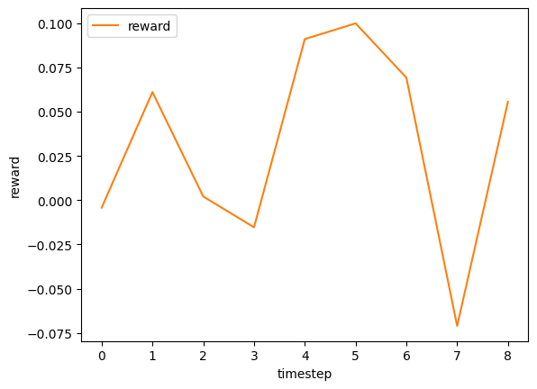

# RECGym: A configurative reinforcement learning environment for recommender system
<details>
<summary><strong>Table of Contents </strong>(click to expand)</summary>

- [RECGym: A reinforcement learning environment for recommendation system](#RECGym-a-reinforcement-learning-environment-for-recommender-system)
- [Overview](#overview)
- [Installation](#installation)
- [Usage](#usage)
- [Citation](#citation)
- [Contribution](#contribution)
- [License](#license)
- [Project Team](#project-team)
- [Contact](#contact)
- [Reference](#reference)

</details>

## Overview

*RECGym* is an open-source simulation platform for recommender system (REC), which is written in Python. The simulator is particularly intended for reinforcement learning algorithms and follows [OpenAI Gym](https://gym.openai.com) and [Gymnasium](https://gymnasium.farama.org/)-like interface. We design RECGym as a configurative environment so that researchers and practitioner can customize the environmental modules including `UserModel`((i.e. `user_preference_dynamics` and `reward_function`).

Note that, RECGym is publicized under [OfflineGym](../) repository, which facilitates the implementation of offline reinforcement learning procedure.

### Basic Setting

In recommendation, the objective of the RL agent is to maximize reward. \
We often formulate this recommendation problem as the following (Partially Observable) Markov Decision Process ((PO)MDP):
- `state`: 
   - A vector representing user preference.  The preference changes over time in an episode by the actions presented by the RL agent.
   - When the true state is unobservable, you can gain observation instead of state.
- `action`:  Index of an item to present to the user.
- `reward`: User engagement signal. Either binary or continuous.

### Implementation

RECGym provides a recommender environment.
- `"RECEnv-v0"`: Standard recommender environment.

RECGym consists of the following a environments.
- [RECEnv](./envs/rec.py#L14): The basic configurative environment.

RECGym is configurative about the following a module.
- [UserModel](./envs/simulator/function.py#L13): Class to define the user model of the recommender system.

Note that, users can customize the above modules by following the [abstract class](./envs/simulator/base.py).

## Installation
RECGym can be installed as a part of [OfflineGym](../) using Python's package manager `pip`.
```
pip install offlinegym
```

You can also install from source.
```bash
git clone https://github.com/negocia-inc/offlinegym
cd offlinegym
python setup.py install
```

## Usage

We provide an example usage of the standard and customized environment. \
The online/offlline RL and Off-Policy Evaluation examples are provides in [OfflineGym's README](../README.md).

### Standard RECEnv

Our standard RECEnv is available from `gym.make()`, following the [OpenAI Gym](https://gym.openai.com) and [Gymnasium](https://gymnasium.farama.org/)-like interface.

```Python
# import RECGym and gym
import recgym
import gym

# (1) standard environment 
env = gym.make('RECEnv-v0')
```

The basic interaction is performed using only four lines of code as follows.

```Python
obs, info = env.reset(), False
while not done:
    action = agent.act(obs)
    obs, reward, done, truncated, info = env.step(action)
```

Let's visualize case with uniform random policy .

```Python
# import from other libraries
from offlinegym.policy import DiscreteEpsilonGreedyHead
from d3rlpy.algos import RandomPolicy as DiscreteRandomPolicy

# define a random agent
agent = DiscreteEpsilonGreedyHead(
      base_policy = DiscreteRandomPolicy(),
      name = 'random',
      n_actions = env.n_items,
      epsilon = 1. ,
      random_state = random_state, 
)

# (2) basic interaction 
obs, info = env.reset()
done = False
# logs
reward_list = []

while not done:
    action = agent.sample_action_online(obs)
    obs, reward, done, truncated, info = env.step(action)
    # logs
    reward_list.append(reward)


# visualize the result
fig = plt.figure()
ax1 = fig.add_subplot(111)
ax1.plot(reward_list[:-1], label='reward', color='tab:orange')
ax1.set_xlabel('timestep')
ax1.set_ylabel('reward')
ax1.legend(loc='upper left')
plt.show()
```
<div align="center"></div>
<figcaption>
<p align="center">
  Transition of the Reward during a Single Episode
</p>
</figcaption>

Note that, while we use [OfflineGym](../README.md) and [d3rlpy](https://github.com/takuseno/d3rlpy) here, RECGym is compatible with any other libraries working on the [OpenAI Gym](https://gym.openai.com) and [Gymnasium](https://gymnasium.farama.org/)-like interface.

### Customized RTGEnv

Next, we describe how to customize the environment by instantiating the environment.

<details>
<summary>List of environmental configurations: (click to expand)</summary>

- `UserModel`: User model which defines user_prefecture_dynamics and reward_function.
- `n_items`: Number of items used for recommendation.
- `n_users`: Number of users used for recommendation.
- `item_feature_dim`: Dimensions of the item feature vectors.
- `user_feature_dim`: Dimensions of the user feature vectors.
- `item_feature_vector`: Feature vectors that characterizes each item.
- `user_feature_vector`: Feature vectors that characterizes each user.
- `reward_type`: Reward type (i.e., continuous / binary).
- `reward_std`: Standard deviation of the reward distribution. Applicable only when reward_type is "continuous".
- `obs_std`: Standard deviation of the observation distribution.
- `step_per_episode`: Number of timesteps in an episode.
- `random_state` : Random state

</details>

```Python
from recgym import RECEnv
env = RECEnv(
        UserModel = UserModel,
        n_items = 100,  # we use 100 items
        n_users = 100,  # 100 users exists
        item_feature_dim = 5,  #each item has 5 dimensional features
        user_feature_dim = 5,  #each user has 5 dimensional features
        item_feature_vector = None,  #determine item_feature_vector from n_items and item_feature_dim in RECEnv
        user_feature_vector = None,  #determine user_feature_vector from n_users and user_feature_dim in RECEnv
        reward_type = "continuous", #we use continuous reward
        reward_std = 0.0,
        obs_std = 0.0, #not add noise to the observation
        step_per_episode = 10,
        random_state = 12345,
)
```

Specifically, users can define their own `UserModel` as follows.

#### Example of UserModel
```Python
# import recgym modules
from recgym import BaseUserModel
from recgym.types import Action
# import other necessary stuffs
from dataclasses import dataclass
from typing import Optional
import numpy as np

@dataclass
class UserModel(BaseUserModel):
    """Initialization."""
    reward_type: str = "continuous"  # "binary"
    reward_std: float = 0.0
    item_feature_vector: Optional[np.ndarray] = None,
    random_state: Optional[int] = None

    def __post_init__(self):
        self.random_ = check_random_state(self.random_state)

    def user_preference_dynamics(
        self,
        state: np.ndarray,
        action: Action,
        alpha: float = 1.0,
    )-> np.ndarray:
        """Function that determines how to update the state (i.e., user preference) based on the recommended item. user_feature is amplified by the recommended item_feature
        """
        state = (state + alpha * state @ self.item_feature_vector[action] * self.item_feature_vector[action])
        state = state / np.linalg.norm(state, ord=2)
        return state

    def reward_function(
        self,
        state: np.ndarray,
        action: Action,
    )-> float:
        """Reward function. inner product of state and recommended item_feature
        """
        reward = state @ self.item_feature_vector[action]
        if self.reward_type is "continuous":
            reward = reward + self.random_.normal(loc=0.0, scale=self.reward_std)
        return reward
```

More examples are available at [quickstart/rec_synthetic_customize_env.ipynb](./examples/quickstart/rec_synthetic_customize_env.ipynb). \
The statistics of the environment is also visualized at [quickstart/rec_synthetic_data_collection.ipynb](./examples/quickstart/rec_synthetic_data_collection.ipynb).

## Citation

If you use our software in your work, please cite our paper:

Haruka Kiyohara, Kosuke Kawakami, Yuta Saito.<br>
**Accelerating Offline Reinforcement Learning Application in Real-Time Bidding and Recommendation: Potential Use of Simulation**<br>
(RecSys'21 SimuRec workshop)<br>
[https://arxiv.org/abs/2109.08331](https://arxiv.org/abs/2109.08331)

Bibtex:
```
@article{kiyohara2021accelerating,
  title={Accelerating Offline Reinforcement Learning Application in Real-Time Bidding and Recommendation: Potential Use of Simulation},
  author={Kiyohara, Haruka and Kawakami, Kosuke and Saito, Yuta},
  journal={arXiv preprint arXiv:2109.08331},
  year={2021}
}
```

## Contribution
Any contributions to RECGym are more than welcome!
Please refer to [CONTRIBUTING.md](../CONTRIBUTING.md) for general guidelines how to contribute the project.

## License

This project is licensed under Apache 2.0 license - see [LICENSE](../LICENSE) file for details.

## Project Team

- [Haruka Kiyohara](https://sites.google.com/view/harukakiyohara) (**Main Contributor**; Tokyo Institute of Technology)
- Kosuke Kawakami (negocia Inc.)
- [Yuta Saito](https://usait0.com/en/) (Cornell University)

## Contact

For any question about the paper and software, feel free to contact: kiyohara.h.aa@m.titech.ac.jp

## References

<details>
<summary><strong>Papers </strong>(click to expand)</summary>

1. Greg Brockman, Vicki Cheung, Ludwig Pettersson, Jonas Schneider, John Schulman, Jie Tang, and Wojciech Zaremba. [OpenAI Gym](https://arxiv.org/abs/1606.01540). *arXiv preprint arXiv:1606.01540*, 2016.

2. Takuma Seno and Michita Imai. [d3rlpy: An Offline Deep Reinforcement Library](https://arxiv.org/abs/2111.03788), *arXiv preprint arXiv:2111.03788*, 2021.

3. Sarah Dean and Jamie Morgenstern. [Preference Dynamics Under Personalized Recommendations](https://arxiv.org/abs/2205.13026). In *Proceedings of the 23rd ACM Conference on Economics and Computation*, 4503-9150, 2022.

</details>

<details>
<summary><strong>Projects </strong>(click to expand)</summary>

This project is inspired by the following three packages.
- **RecoGym**  -- an RL environment for recommender systems: [[github](https://github.com/criteo-research/reco-gym)] [[paper](https://arxiv.org/abs/1808.00720)]
- **RecSim** -- a configurative RL environment for recommender systems: [[github](https://github.com/google-research/recsim)] [[paper](https://arxiv.org/abs/1909.04847)]
- **AuctionGym** -- an RL environment for online advertising auctions: [[github](https://github.com/amzn/auction-gym)] [[paper](https://www.amazon.science/publications/learning-to-bid-with-auctiongym)]
- **FinRL** -- an RL environment for finance: [[github](https://github.com/AI4Finance-Foundation/FinRL)] [[paper](https://arxiv.org/abs/2011.09607)]

</details>

