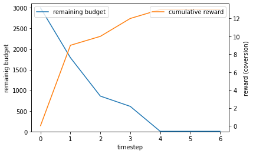

# RTBGym: 入札オークションの強化学習環境
<details>
<summary><strong>目次</strong>(クリックして展開)</summary>

- [RTBGym: 入札オークションの強化学習環境](#rtbgym-入札オークションの強化学習環境)
- [概要](#概要)
- [インストール](#インストール)
- [用法](#用法)
  - [離散](#discrete-control)
  - [連続](#continuous-control)
- [引用](#citation)
- [貢献](#contribution)
- [ライセンス](#license)
- [プロジェクトチーム](#project-team)
- [連絡先](#contact)
- [参考文献](#reference)

</details>

## 概要

*RTBGym* は，ディスプレイ広告のreal-time bidding(RTB)用のオープンソースシミュレーションプラットフォームで，Pythonで書かれています．このシミュレーターは特に強化学習アルゴリズム向けに設計されており，[OpenAI Gym](https://gym.openai.com) および [Gymnasium](https://gymnasium.farama.org/) のようなインターフェースに従っています．RTBGymは，研究者や実践者が `WinningPriceDistribution`，`ClickThroughRate`，`ConversionRate` などの環境モジュールをカスタマイズできるように設計された設定可能な環境です．

RTBGymは [SCOPE-RL](../) リポジトリの下で公開されており，オフライン強化学習手順の実装を容易にします．

### 基本設定

RTBにおいて強化学習エージェントの目的は，予算制約が与えられもとで，一つのエピソード内でのKPI(クリックやコンバージョン)を最大化することです. KPIを最大にするために，エージェントは入札価格関数パラメータ $\alpha$ を選択します．
入札価格関数パラメータ $\alpha$ を利用することで以下の入札価格を決定します．

<p align="center">
    $bid_{t,i} = \alpha \cdot r^{\ast}$,
</p>

ここで$r^{\ast}$はKPIの予測値または期待値を表します.

この問題を制約付きマルコフ決定過程(CMDP)として定式化します.

- `タイムステップ`: 一つのエピソード(一日，一週間)に含まれるタイムステップ(24時間，数日など).
- `状態`: それぞれのタイムステップで，環境からフィードバックが返ってきます.
  - タイムステップ
  - 残予算
  - 一つ前のタイムステップでのインプレッション単位の特徴(予算消費率，一つのインプレッションあたりのコスト，オークション落札率，報酬)
  - 一つ前のタイムステップでの入札関数パラメータ(強化学習エージェントが選ぶ行動) 
- `行動`: エージェントはKPIを最大化するために入札価格パラメータ$\alpha$を選択します.
- `報酬`: 一つのタイムステップあたりに得られたクリックまたはコンバージョンの合計数.
- `制約`: あらかじめ決められた，一つのエピソードあたりの予算．

目的は予算制約の中で強化学習を利用して, 累積報酬を最大化する方策を得ることです．

### 実装

RTBGym は2つの標準的なRTB環境を提供します.
- `"RTBEnv-discrete-v0"`: 連続行動空間に対する標準的な環境．
- `"RTBEnv-continuous-v0"`: 離散行動空間に対する標準的な環境．

RTBGymは，次の2つの環境で構成されています．
- [RTBEnv](./envs/rtb.py#L24): 連続行動空間を持つ標準的な設定可能な環境．
- [CustomizedRTBEnv](./envs/wrapper_rtb.py#L15): 行動空間と報酬予測器を指定するカスタマイズされた環境．

RTBGymは，以下の3つのモジュールについて設定可能です．
- [WinningPriceDistribution](./envs/simulator/function.py#L18): オークション入札の落札価格分布を定義するクラス．
- [ClickThroughRate](./envs/simulator/function.py#L183): ユーザーのクリック率を定義するクラス．
- [ConversionRate](./envs/simulator/function.py#L393): ユーザーのコンバージョン率を定義するクラス．

上記モジュールは，[abstract class](./envs/simulator/base.py)に従ってカスタマイズすることができます．\
また，入札機能は[Bidder](./envs/simulator/bidder.py#15)クラスで，オークションのシミュレーションは[Simulator](./envs/simulator/rtb_synthetic.py#23)クラスでそれぞれ定義されています．

## インストール
RTBGymは，Pythonのの`pip`を使用して，[SCOPE-RL](../)の一部としてインストールできます．

```
pip install scope-rl
```

また，コードからインストールすることもできます
```bash
git clone https://github.com/hakuhodo-technologies/scope-rl
cd scope-rl
python setup.py install
```

## 用法

標準環境とカスタマイズされた環境の使用例を提供します．
オンライン/オフラインRLおよびオフ方策評価の例は，[SCOPE-RLのREADME](../README.md)で提供されています

### 標準的な RTBEnv

標準的なRTBEnvは，[OpenAI Gym](https://gym.openai.com) や [Gymnasium](https://gymnasium.farama.org/)のようなインターフェースに従って `gym.make()` から利用可能です．

```Python
# rtbgymとgymをインポートする
import rtbgym
import gym

# (1) 連続行動空間に対する標準的な環境
env = gym.make('RTBEnv-discrete-v0')

# (2) 離散行動空間に対する標準的な環境
env_ = gym.make('RTBEnv-continuous-v0')
```

基本的なインタラクションは，以下の4行のコードのみで実行できます．

```Python
obs, info = env.reset(), False
while not done:
    action = agent.act(obs)
    obs, reward, done, truncated, info = env.step(action)
```

一様なランダム方策の場合を視覚化してみましょう．(連続行動空間) 離散の場合も同じように行えます．


```Python
# 他のライブラリからインポートする
from offlinegym.policy import OnlineHead
from d3rlpy.algos import RandomPolicy as ContinuousRandomPolicy
from d3rlpy.preprocessing import MinMaxActionScaler
import matplotlib.pyplot as plt

# ランダムエージェントを定義する (連続行動空間)
agent = OnlineHead(
    ContinuousRandomPolicy(
        action_scaler=MinMaxActionScaler(
            minimum=0.1,  # 方策が取り得る最小値
            maximum=10,  # 方策が取り得る最大値
        )
    ),
    name="random",
)
agent.build_with_env(env)

# (3) 連続空間での基本的なインタラクション
obs, info = env.reset()
done = False
# ログ
remaining_budget = [obs[1]]
cumulative_reward = [0]

while not done:
    action = agent.predict_online(obs)
    obs, reward, done, truncated, info = env.step(action)
    # ログ
    remaining_budget.append(obs[1])
    cumulative_reward.append(cumulative_reward[-1] + reward)

# 結果を視覚化する
fig = plt.figure()
ax1 = fig.add_subplot(111)
ax1.plot(remaining_budget[:-1], label='remaining budget')
ax2 = ax1.twinx()
ax2.plot(cumulative_reward[:-1], label='cumulative reward', color='tab:orange')
ax1.set_xlabel('timestep')
ax1.set_ylabel('remainig budget')
ax1.set_ylim(0, env.initial_budget + 100)
ax2.set_ylabel('reward (coversion)')
ax1.legend(loc='upper left')
ax2.legend(loc='upper right')
plt.show()
```
<div align="center"></div>
<figcaption>
<p align="center">
  1エピソード中の残予算と累積報酬の推移
</p>
</figcaption>

ここで[SCOPE-RL](../README.md) と [d3rlpy](https://github.com/takuseno/d3rlpy) を利用していますが，RTBGymは[OpenAI Gym](https://gym.openai.com) と [Gymnasium](https://gymnasium.farama.org/)のようなインターフェースで動作する他のライブラリとも互換性があります．

### Customized RTBEnv

次に，環境のインスタンス化によるカスタマイズの方法を説明します．

<details>
<summary>環境設定のリスト: (クリックして展開)</summary>

- `objective`: RTBの重要性能指標 (KPI, "click"または"conversion")
- `cost_indicator`:コストが発生するタイミング("impression", "click", "conversion")
- `step_per_episode`: 一エピソードでの意思決定の数
- `initial_budget`: 一エピソードでの初期予算 (制約)
- `n_ads`: 入札オークション環境上の広告の数
- `n_users`: 入札オークション環境上のユーザーの数
- `ad_feature_dim`: 広告の特徴ベクトルの次元
- `user_feature_dim`: ユーザーの特徴ベクトルの次元
- `ad_feature_vector`: 広告特徴量 (ベクトル)
- `user_feature_vector`: ユーザー特徴量 (ベクトル)
- `ad_sampling_rate`: 入札オークションでどの広告を選ぶかを決めるサンプリング確率
- `user_sampling_rate`: 入札オークションでどのユーザーが対象となるかを決めるサンプリング確率
- `WinningPriceDistribution`: 入札オークションの落札価格分布
- `ClickTroughRate`: クリック率 (クリック/ インプレッション)
- `ConversionRate`: コンバージョン率 (コンバージョン/ クリック)
- `standard_bid_price_distribution`: 平均インプレッション確率が0.5と予想される時の入札価格の分布
- `minimum_standard_bid_price`: 標準入札価格の最低値
- `search_volume_distribution`: タイムステップごとの検索ボリューム分布
- `minimum_search_volume`: タイムステップごとの最小の検索ボリューム
- `random_state`: ランダムシード

</details>

```Python
from rtbgym import RTBEnv
env = RTBEnv(
    objective="click",  # クリック数の合計を最大化
    cost_indicator="click",  # クリックするごとにコストが発生
    step_per_episode=14,  # 1エピソード14日とする14 days as an episode
    initial_budget=5000,  # 14日で予算は5000
    random_state=random_state,
)
```

具体的には，ユーザーは以下のように独自の `WinningPriceDistribution`と`ClickThroughRate`と`ConversionRate` を定義できます

#### オークションの落札価格分布のカスタマイズの例
```Python
# rtbgymモジュールをインポートする
from rtbgym import BaseWinningPriceDistribution
from rtbgym.utils import NormalDistribution
# その他必要なものをインポートする
from dataclasses import dataclass
from typing import Optional, Union, Tuple
import numpy as np

@dataclass
class CustomizedWinningPriceDistribution(BaseWinningPriceDistribution):
    """初期化."""
    n_ads: int
    n_users: int
    ad_feature_dim: int
    user_feature_dim: int
    step_per_episode: int
    standard_bid_price_distribution: NormalDistribution = NormalDistribution(
        mean=50,
        std=5,
        random_state=12345,
    )
    minimum_standard_bid_price: Optional[Union[int, float]] = None
    random_state: Optional[int] = None
    
    def __post_init__(self):
        self.random_ = check_random_state(self.random_state)
    
    def sample_outcome(
        self,
        bid_prices: np.ndarray,
        **kwargs,
    ) -> Tuple[np.ndarray]:
        """各オークションのインプレッションとセカンドプライスを確率的に決定する．"""
        #  単純な正規分布からの落札価格のサンプリング
        winning_prices = self.random_.normal(
            loc=self.standard_bid_price,
            scale=self.standard_bid_price / 5,
            size=bid_prices.shape,
        )
        impressions = winning_prices < bid_prices
        return impressions.astype(int), winning_prices.astype(int)
    
    @property
    def standard_bid_price(self):
        return self.standard_bid_price_distribution.mean
```

#### クリック率(とコンバージョン率)のカスタマイズの例
```Python
from rtbgym import BaseClickAndConversionRate
from rtbgym.utils import sigmoid
@dataclass
class CustomizedClickThroughRate(BaseClickAndConversionRate):
    """初期化."""
    n_ads: int
    n_users: int
    ad_feature_dim: int
    user_feature_dim: int
    step_per_episode: int
    random_state: Optional[int] = None
    
    def __post_init__(self):
        self.random_ = check_random_state(self.random_state)
        self.ad_coef = self.random_.normal(
            loc=0.0, 
            scale=0.5, 
            size=(self.ad_feature_dim, 10),
        )
        self.user_coef = self.random_.normal(
            loc=0.0, 
            scale=0.5, 
            size=(self.user_feature_dim, 10),
        )
    
    def calc_prob(
        self,
        ad_ids: np.ndarray,
        user_ids: np.ndarray,
        ad_feature_vector: np.ndarray,
        user_feature_vector: np.ndarray,
        timestep: Union[int, np.ndarray],
    ) -> np.ndarray:
        """CTRの計算 (インプレッションあたりのクリック)."""
        ad_latent = ad_feature_vector @ self.ad_coef
        user_latent = user_feature_vector @ self.user_coef
        ctrs = sigmoid((ad_latent * user_latent).mean(axis=1))
        return ctrs
    
    def sample_outcome(
        self,
        ad_ids: np.ndarray,
        user_ids: np.ndarray,
        ad_feature_vector: np.ndarray,
        user_feature_vector: np.ndarray,
        timestep: Union[int, np.ndarray],
    ) -> np.ndarray:
        """impression=Trueの場合にクリックが発生するかどうかを確率的に決定します."""
        ctrs = self.calc_prob(
            timestep=timestep,
            ad_ids=ad_ids,
            user_ids=user_ids,
            ad_feature_vector=ad_feature_vector,
            user_feature_vector=user_feature_vector,
        )
        clicks = self.random_.rand(len(ad_ids)) < ctrs
        return clicks.astype(int)
```


### Wrapperクラス

`CustomizedRTBEnv` は行動空間の離散化や再定義を可能にするモジュールです．
`CustomizedRTBEnv`を用いて，独自の `reward_predictor` を設定することもできます．

<details>
<summary>環境設定のリスト: (クリックして展開)</summary>

- `original_env`: ベースとなるRTB環境
- `reward_predictor`: 入札価格を決定するための報酬を予測する機械学習モデル
- `scaler`: 入札価格決定に使用するスケーリング係数 (定数)
- `action_min`: 調整率の最小値
- `action_max`: 調整率の最大値
- `action_type`: 強化学習エージェントの行動タイプ ("discrete" または "continuous")
- `n_actions`: 離散行動の数
- `action_meaning`: エージェントの行動インデックスと実際の"離散"行動のマッピング関数

</details>

```Python
from rtbgym import CustomizedRTBEnv
custom_env = CustomizedRTBEnv(
    original_env=env,
    reward_predictor=None,  # 真の報酬予測器として真の(期待)報酬を利用
    action_type="discrete",
)
```

より多くの例は[quickstart_ja/rtb/rtb_synthetic_customize_env_ja.ipynb](./examples/quickstart_ja/rtb/rtb_synthetic_customize_env_ja.ipynb)を参照してください．

環境の統計量の可視化は[examples/quickstart_ja/rtb/rtb_synthetic_data_collection_ja.ipynb](./examples/quickstart_ja/rtb/rtb_synthetic_data_collection_ja.ipynb)で確認できます．

さらに，オンライン/オフライン強化学習やオフ方策評価，オフ方策選択の実装例は以下を参照してください．[examples/quickstart_ja/rtb/rtb_synthetic_discrete_basic_ja.ipynb](./examples/quickstart_ja/rtb/rtb_synthetic_discrete_basic_ja.ipynb) (離散行動空間) and [examples/quickstart_ja/rtb/rtb_synthetic_continuous_basic_ja.ipynb](./examples/quickstart_ja/rtb/rtb_synthetic_continuous_basic_ja.ipynb) (連続行動空間).

## 引用

ソフトウェアを使用する場合は，以下の論文の引用をお願いします．
Haruka Kiyohara, Ren Kishimoto, Kosuke Kawakami, Ken Kobayashi, Kazuhide Nakata, Yuta Saito.<br>
**SCOPE-RL: A Python Library for Offline Reinforcement Learning, Off-Policy Evaluation, and Policy Selection**<br>
[link]() (a preprint coming soon..)

Bibtex:
```
@article{kiyohara2023towards,
  author = {Kiyohara, Haruka and Kishimoto, Ren and Kawakami, Kosuke and Kobayashi, Ken and Nataka, Kazuhide and Saito, Yuta},
  title = {SCOPE-RL: A Python Library for Offline Reinforcement Learning, Off-Policy Evaluation, and Policy Selection},
  journal={arXiv preprint arXiv:23xx.xxxxx},
  year = {2023},
}
```

## 貢献

SCOPE-RLへの貢献も歓迎しています！
プロジェクトへの貢献方法については， [CONTRIBUTING.md](./CONTRIBUTING.md)を参照してください．

## ライセンス

このプロジェクトはApache 2.0ライセンスのもとでライセンスされています - 詳細については[LICENSE](LICENSE)ファイルをご覧ください．

## プロジェクトチーム

- [Haruka Kiyohara](https://sites.google.com/view/harukakiyohara) (**Main Contributor**)
- Ren Kishimoto (Tokyo Institute of Technology)
- Kosuke Kawakami (HAKUHODO Technologies Inc.)
- Ken Kobayashi (Tokyo Institute of Technology)
- Kazuhide Nakata (Tokyo Institute of Technology)
- [Yuta Saito](https://usait0.com/en/) (Cornell University)

## 連絡先

論文やソフトウェアに関する質問がある場合は，hk844@cornell.eduまでお気軽にお問い合わせください．

## 参考文献

<details>
<summary><strong>論文 </strong>(クリックして展開)</summary>

1. Greg Brockman, Vicki Cheung, Ludwig Pettersson, Jonas Schneider, John Schulman, Jie Tang, and Wojciech Zaremba. [OpenAI Gym](https://arxiv.org/abs/1606.01540). *arXiv preprint arXiv:1606.01540*, 2016.

2. Takuma Seno and Michita Imai. [d3rlpy: An Offline Deep Reinforcement Library](https://arxiv.org/abs/2111.03788), *arXiv preprint arXiv:2111.03788*, 2021.

3. Di Wu, Xiujun Chen, Xun Yang, Hao Wang, Qing Tan, Xiaoxun Zhang, Jian Xu, and Kun Gai. [Budget Constrained Bidding by Model-free Reinforcement Learning in Display Advertising](https://arxiv.org/abs/1802.08365). In *Proceedings of the 27th ACM International Conference on Information and Knowledge Management*, 1443-1451, 2018.

4. Jun Zhao, Guang Qiu, Ziyu Guan, Wei Zhao, and Xiaofei He. [Deep Reinforcement Learning for Sponsored Search Real-time Bidding](https://arxiv.org/abs/1803.00259). In *Proceedings of the 24th ACM SIGKDD International Conference on Knowledge Discovery and Data Mining*, 1021-1030, 2018.

5. Wen-Yuan Zhu, Wen-Yueh Shih, Ying-Hsuan Lee, Wen-Chih Peng, and Jiun-Long Huang. [A Gamma-based Regression for Winning Price Estimation in Real-Time Bidding Advertising](https://ieeexplore.ieee.org/document/8258095). In *IEEE International Conference on Big Data*, 1610-1619, 2017.

</details>

<details>
<summary><strong>プロジェクト </strong>(クリックして展開)</summary>

このプロジェクトは，以下の4つのパッケージを参考にしています．
- **AuctionGym** -- 広告入札のための強化学習環境: [[github](https://github.com/amzn/auction-gym)] [[論文]
(https://www.amazon.science/publications/learning-to-bid-with-auctiongym)]
- **RecoGym**  -- 推薦システムのための強化学習環境 [[github](https://github.com/criteo-research/reco-gym)] [[論文](https://arxiv.org/abs/1808.00720)]
- **RecSim** -- a configurative RL environment for recommender systems: [[github](https://github.com/google-research/recsim)] [[paper](https://arxiv.org/abs/1909.04847)]
- **FinRL** -- an RL environment for finance: [[github](https://github.com/AI4Finance-Foundation/FinRL)] [[paper](https://arxiv.org/abs/2011.09607)]

</details>

